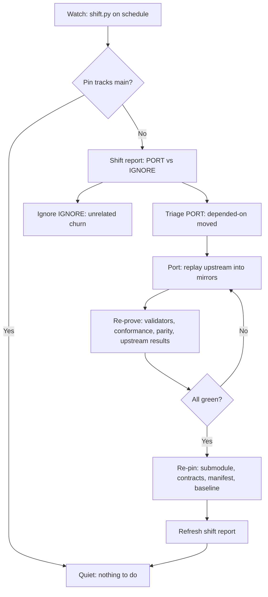
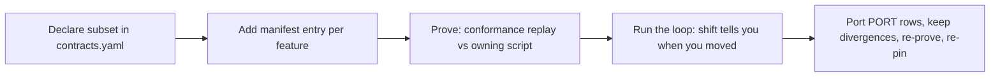

# Firstmate MCP — an MCP-built adaption of [firstmate](https://github.com/kunchenguid/firstmate), shaped to Trillium's desire of how firstmate works

firstmate_mcp is an MCP-built adaption of firstmate: every tool shells out to
firstmate's own `bin/fm-*.sh` scripts (pinned as a git submodule at
`sources/firstmate`) and never reimplements firstmate behavior. Trillium's
shape of how firstmate works is the smarts-only line: launch ability yes,
development ability no — observe the fleet, steer workers, launch crews, but
no code-writing, landing, or repo-mutation surface.

The three lists below are generated, not hand-written, so they cannot drift
from the tree. Regen with:

```sh
python3 scripts/gen_readme_lists.py --check   # verify the embed is current
```

<!-- GENERATED:BEGIN -->
### SUPPORTED firstmate features (behavior-identical through the adapter)

No-approval tools: the adapter's typed projection equals the owning
script's observable output (modulo the envelope wrap).

- `backlog` — via `fm-fleet-snapshot.sh` (pinned in schema/contracts.yaml)
- `bearings_board_path` — via `fm-bearings-board.sh` (pinned in schema/contracts.yaml)
- `bearings_snapshot` — via `fm-bearings-snapshot.sh` (pinned in schema/contracts.yaml)
- `contributions_pending` — via `fm-contributions.sh` (pinned in schema/contracts.yaml)
- `contributions_snapshot` — via `fm-contributions.sh` (pinned in schema/contracts.yaml)
- `crew_state` — via `fm-crew-state.sh` (pinned in schema/contracts.yaml)
- `decision_diverged` — via `fm-captain-hold.sh` (adapter-native projection)
- `decision_open` — via `fm-captain-hold.sh` (adapter-native projection)
- `decision_verify` — via `fm-captain-hold.sh` (adapter-native projection)
- `fleet_poll` — via `fm-fleet-snapshot.sh` (adapter-native projection)
- `fleet_snapshot` — via `fm-fleet-snapshot.sh` (pinned in schema/contracts.yaml)
- `fleet_view` — via `fm-fleet-view.sh` (pinned in schema/contracts.yaml)
- `guard_check` — via `fm-guard.sh` (pinned in schema/contracts.yaml)
- `handoff_status` — via `native (no owning script)` (pinned in schema/contracts.yaml)
- `harness_detect` — via `fm-harness.sh` (pinned in schema/contracts.yaml)
- `home_summary` — via `native (no owning script)` (pinned in schema/contracts.yaml)
- `home_summary_refresh` — via `fm-home-summary-refresh.sh` (pinned in schema/contracts.yaml)
- `inbox_list` — via `fm-inbox.sh` (pinned in schema/contracts.yaml)
- `inbox_status` — via `fm-inbox.sh` (pinned in schema/contracts.yaml)
- `lease_check` — via `fm-lease.sh` (pinned in schema/contracts.yaml)
- `lint_versions` — via `fm-lint.sh` (pinned in schema/contracts.yaml)
- `lock_status` — via `fm-lock.sh` (pinned in schema/contracts.yaml)
- `mail_read` — via `fm-mail.sh` (pinned in schema/contracts.yaml)
- `mail_status` — via `fm-mail.sh` (pinned in schema/contracts.yaml)
- `peek` — via `fm-peek.sh` (pinned in schema/contracts.yaml)
- `pr_state` — via `fm-pr-state.sh` (pinned in schema/contracts.yaml)
- `project_mode` — via `fm-project-mode.sh` (pinned in schema/contracts.yaml)
- `relay_poll` — via `fm-x-poll.sh` (pinned in schema/contracts.yaml)
- `remote_delta` — via `fm-remote-delta-read.sh` (pinned in schema/contracts.yaml)
- `remote_doctor` — via `fm-remote-doctor.sh` (pinned in schema/contracts.yaml)
- `remote_file` — via `fm-remote-file.sh` (pinned in schema/contracts.yaml)
- `review_diff` — via `fm-review-diff.sh` (pinned in schema/contracts.yaml)
- `send_message` — via `fm-send.sh` (pinned in schema/contracts.yaml)
- `startup_memory` — via `fm-startup-memory-budget.sh` (pinned in schema/contracts.yaml)
- `status_tail` — via `native (no owning script)` (pinned in schema/contracts.yaml)
- `tool_update_check` — via `fm-tool-update-check.sh` (pinned in schema/contracts.yaml)
- `vendor_auth_probe` — via `fm-vendor-auth-probe.sh` (pinned in schema/contracts.yaml)
- `voice_status` — via `fm_voice_records.py` (pinned in schema/contracts.yaml)
- `wake_drain` — via `fm-wake-drain.sh` (pinned in schema/contracts.yaml)

### CHANGED firstmate features (stricter adapter behavior, approval gates)

Same owning scripts, narrower surface: safe flag subsets only,
revalidated ids/paths/text, explicit per-call approval.

- `decision_complete` — via `fm-captain-hold.sh` (Tier 3 approval, approval required)
- `decision_hold` — via `fm-decision-hold.sh` (Tier 3 approval, approval required)
- `decision_release` — via `fm-decision-hold.sh` (Tier 3 approval, approval required)
- `decision_resolve` — via `fm-decision-hold.sh` (Tier 3 approval, approval required)
- `handoff_move` — via `fm-backlog-handoff.sh` (Tier 3 approval, approval required)
- `lifecycle_exit` — via `fm-control.sh` (Tier 3 approval, approval required)
- `lifecycle_interrupt` — via `fm-control.sh` (Tier 3 approval, approval required)
- `lifecycle_relaunch` — via `fm-control.sh` (Tier 3 approval, approval required)
- `lifecycle_resume` — via `fm-control.sh` (Tier 3 approval, approval required)
- `lifecycle_suspend` — via `fm-control.sh` (Tier 3 approval, approval required)
- `mail_send` — via `fm-mail.sh` (Tier 4 approval+relay, approval required)
- `relay_dismiss` — via `fm-x-dismiss.sh` (Tier 4 approval+relay, approval required)
- `relay_followup` — via `fm-x-followup.sh` (Tier 4 approval+relay, approval required)
- `relay_reply` — via `fm-x-reply.sh` (Tier 4 approval+relay, approval required)
- `remote_control` — via `fm-remote-secondmate-control.sh` (Tier 3 approval, approval required)
- `review_decision` — via `fm-captain-hold.sh` (Tier 3 approval, approval required)
- `scaffold_brief` — via `fm-brief.sh` (Tier 3 approval, approval required)
- `secondmate_nudge` — via `fm-secondmate-reconcile.sh` (Tier 3 approval, approval required)
- `secondmate_report` — via `fm-secondmate-report.sh` (Tier 3 approval, approval required)
- `secondmate_restart` — via `fm-secondmate-restart.sh` (Tier 3 approval, approval required)
- `spawn_crew` — via `fm-spawn.sh` (Tier 3 approval, approval required)
- `voice_queue` — via `fm_voice_records.py` (Tier 3 approval, approval required)

Refused by the adapter deny-list (no tool, answered unknown):

- `arm_pr_check` (code-forbidden)
- `daemon_restart` (out of smarts-only scope)
- `daemon_start` (out of smarts-only scope)
- `daemon_stop` (out of smarts-only scope)
- `merge_local` (code-forbidden)
- `merge_pr` (code-forbidden)
- `promote_scout` (code-forbidden)
- `repo_commit` (out of smarts-only scope)
- `repo_edit` (out of smarts-only scope)
- `repo_merge` (out of smarts-only scope)
- `repo_push` (out of smarts-only scope)
- `teardown_crew` (code-forbidden)
- `watch_start` (out of smarts-only scope)
- `watch_stop` (out of smarts-only scope)

### NEW Trillium features (exist only in this layer)

- Drift detection — `drift/baseline.json` seeds 163 observed
  `bin/fm-*.sh` surfaces at firstmate rev `aaf67489`; `drift/snapshot.py` +
  `drift/check.py` diff feature drift from behavior drift.
- Upstream-shift signal — `sources/firstmate` pins upstream firstmate;
  `drift/shift.py` diffs the pin against upstream main and reports
  which depended-on surfaces moved, so TS/Python ports start from
  that report.
- Subprocess envelope — TypeScript server returns every tool call within
  `SUBPROCESS_TIMEOUT_S=30` with `MAX_OUTPUT_BYTES=1048576`,
  process-group kill on timeout so timed-out reads leave no orphans.
- Async receipts — `receipt_submit` detaches one call past the 30s
  budget and returns a pending receipt; `receipt_status` reports
  running/done/failed with the result attached, TTL expiry, and
  per-home confinement so receipts never leak across homes.
- Auth tiers in code — `ts/src/auth.ts` assigns every tool a tier,
  writes the JSON-lines audit log; every authority-bearing tool
  refuses without an `I authorize` string.
- Contract map — `schema/contracts.yaml` declares the depended-on
  subset with stability tiers; `schema/validate.py` fails naming the
  stale pin; `schema/matrix.md` is the human view.
- Conformance fixtures — `ts/tests/conformance-*.test.ts` proves TS server
  output equals the owning scripts' output via stub homes (sharded & hash-cached across
  Bun and Node runtimes).
- Upstream preservation — `tests/upstream/` runs upstream firstmate
  tests unchanged against the TypeScript server via thin adapters
  (upstream reference skips cleanly without a checkout); verdicts
  seeded in `UPSTREAM-RESULTS.md`, divergences explicit in
  `tests/upstream/divergences.json`.
- TypeScript sibling — `ts/` implements the 63-tool
  contract over stdio as the sole server (zero runtime dependencies beyond Effect);
  `tests/conformance/ts-parity.sh` runs multi-runtime conformance fixtures under bun and node.
- Customizable follow-on actions — `ts/src/followon.ts` provides configurable
  chained follow-on actions for any MCP tool with condition evaluation,
  context forwarding, strict anti-laundering auth gates, and loop termination.
- Proof suites in this tree (all run in gates below):
  - `tests/mcp-adapter.test.sh`
  - `tests/mcp-schema.test.sh`
  - `tests/drift-check.test.sh`
  - `tests/fm-mcp-authz.test.sh`
  - `tests/fm-coverage.test.sh`
  - `tests/fm-manifest.test.sh`
  - `tests/mcp-hooks.test.sh`
  - `tests/conformance/conformance.sh`
  - `tests/conformance/ts-parity.sh`
  - `tests/upstream/run_upstream.sh`
  - `tests/test_drift.py`
  - `ts/tests/server.test.ts`
  - `ts/tests/timeout.test.ts`
  - `ts/tests/receipt.test.ts`
  - `ts/tests/conformance-read.test.ts`
  - `ts/tests/conformance-remote.test.ts`
  - `ts/tests/conformance-system.test.ts`
  - `ts/tests/auth.test.ts`
  - `ts/tests/followon.test.ts`

### Support-coverage view (per upstream command area)

Every upstream `bin/fm-*.sh` top-level command plus `backends/`, grouped
by command area with its mirror status. Full view: `manifest/COVERAGE.md`
(generated by `scripts/gen_coverage.py`; gate: `tests/fm-coverage.test.sh`).

| Area | Mirrored | Denied | Gap |
| --- | --- | --- | --- |
| Fleet runs | 3 | 0 | 5 |
| Supervision | 8 | 4 | 28 |
| Sessions | 4 | 0 | 21 |
| Backlog / decisions | 4 | 0 | 9 |
| Secondmates / remotes | 7 | 0 | 13 |
| PR pipeline | 2 | 5 | 4 |
| Relay | 4 | 0 | 4 |
| Voice / mail | 3 | 0 | 1 |
| Digests | 6 | 0 | 0 |
| Installs | 4 | 0 | 19 |

Mirrored names the MCP tool; `stale` flags an owning script upstream removed
after the pin (the tool still dispatches the old name). Denied names the
refusal reason; gap is the explicitly unmirrored port backlog.
<!-- GENERATED:END -->

## Contents

- [What this is](#what-this-is)
- [Line binding and checkout resolution](#line-binding-and-checkout-resolution)
- [Quickstart](#quickstart)
- [Commit hooks](#commit-hooks)
- [Cutover](#cutover)
- [Tools](#tools)
- [Authorization tiers](#authorization-tiers)
- [Contract map](#contract-map)
- [Conformance](#conformance)
- [Drift detection](#drift-detection)
- [Design choices](#design-choices)
- [Layout](#layout)
- [History](#history)

## What this is

Typed [Model Context Protocol](https://modelcontextprotocol.io) tools over
firstmate. The server exposes reads, steering, and launch control as
JSON-Schema-typed tools that shell out to firstmate's own scripts — it never
reimplements firstmate behavior.

The smarts-only line: **launch ability yes, development ability no.** This
layer may observe the fleet, steer workers, and launch or control crews. It
has no code-writing surface: no edit, commit, merge, or PR tools, no direct
repo mutation, no teardown that discards work, no promote-to-ship paths.
Firstmate stays the implementation; this repo is only the typed doorway.

## Line binding and checkout resolution

**Line:** this repo targets the `trillium/firstmate` fork line,
fork-pinned — not upstream `kunchenguid/firstmate` as a live dependency.
(Ratification: bead `task-8d0ah.1`; the why: epic `task-8d0ah`.)

**Pinned rev:** two pins, each with one job. The `sources/firstmate`
submodule gitlink (currently `3eb5b63`) is the authoritative checkout pin —
confirm it with `git ls-tree HEAD sources/firstmate`.
`drift/baseline.json` (`firstmate_revision`, currently `aaf67489`, 163
`bin/fm-*.sh` surfaces inventoried 2026-09-17) is the drift inventory the
depended-on contracts are checked against. The two advance separately.

Radar vs working copy: the gitlink and baseline above are the upstream
fingerprint — early-warning radar via `drift/shift.py` — while the `fork`
block in `manifest/FEATURES.yaml` (mirrored in `schema/contracts.yaml`) pins
the trillium/firstmate commit the adapter was proven against. Everything runs
against the fork; a shift report showing Kun fixed something becomes a
deliberate port decision, never an automatic merge.

**Runtime resolution order** (server: `ts/src/constants.ts`):

1. `CHECKOUT_BIN` — repo-root `bin/` if present. Absent by design (never
   add one; it would shadow the live binding), so this always falls through.
2. `FM_HOME/bin` — the live binding. `FM_HOME` defaults to the checkout
   root; `scripts/fm-mcp-launch.sh` requires it pinned (absolute, carrying
   `bin/fm-fleet-snapshot.sh`). With no checkout behind it, tool calls fail
   closed with `executable not found`.

Test/conformance reference lookup only:
`FIRSTMATE_HOME` > `FM_REAL_HOME` > `FM_CHECKOUT` > well-known sibling
checkout; the suite skips cleanly when none resolves.

Example — point the server at a checkout:

```sh
FM_HOME=/path/to/firstmate bun ts/dist/server.js
```

`fleet_snapshot` then dispatches `$FM_HOME/bin/fm-fleet-snapshot.sh`.

**Re-baseline procedure:** snapshot the live checkout and diff against the
baseline (`python3 drift/snapshot.py --fm-home /path/to/firstmate -o
/tmp/observed.json`, then `python3 drift/check.py drift/baseline.json
/tmp/observed.json` — full usage under [Drift detection](#drift-detection));
procedure ownership and cadence live on bead `task-8d0ah.2`.

## Quickstart

Requirements: Bun (primary runtime) or Node 20+, Effect.

Build the server:

```sh
cd ts && bun install && bun run build
```

Run the server (newline-delimited JSON-RPC on stdio, logs on stderr):

```sh
bun ts/dist/server.js
```

Point it at a firstmate checkout to wire the live tools:

```sh
FM_HOME=/path/to/firstmate bun ts/dist/server.js
```

Without a firstmate checkout beside it, the server resolves its tool scripts
from `$FM_HOME/bin` and tool calls fail closed with `executable not found`.

Run the end-to-end proof (335 checks, self-contained — no checkout needed):

```sh
cd ts && bun run test:bun
```

The suite handshakes, lists tools, exercises every read, proves traversal and
validation refusals, proves approval gating on every authority-bearing tool,
proves audit duration_ms timing, and proves every removed code-writing surface answers unknown-tool.

## Commit hooks

This repository enforces Conventional Commits (`<type>(<scope>): <subject>` or `<type>: <subject>`) via a lightweight, zero-dependency git `commit-msg` hook matching observed repository history.

### Allowed types

`feat`, `fix`, `chore`, `docs`, `refactor`, `test`, `ci`, `perf`, `build`, `revert`, `style`

### Installation

Configure hooks for the checkout:

```sh
bash scripts/setup-hooks.sh
```

This sets `core.hooksPath` to `.githooks` in the repository configuration.

### Worktrees and Treehouse pools

Git shares `core.hooksPath` across all worktrees linked to the repository. Because `.githooks/` is tracked in version control, running `bash scripts/setup-hooks.sh` in the primary checkout or any worktree (including treehouse-pooled worktrees) activates hook enforcement across all present and future worktrees without copying files into `.git/hooks`.

### Escape hatch

For rare legitimate exceptions or automated worker scripts:

```sh
git commit --no-verify -m "..."
# or set environment variable
FM_SKIP_HOOKS=1 git commit -m "..."
```

## Cutover

Serve a live firstmate fleet through this layer, local-only:

```sh
scripts/fm-mcp-launch.sh --home /path/to/firstmate
```

The launcher pins one `FM_HOME` (required: flag or env, absolute, carrying
`bin/fm-fleet-snapshot.sh`), stays on stdio JSON-RPC (no TCP/SSE/network
listeners — network flags are refused), and execs the TypeScript server
(`--runtime bun|node` selects the runtime). Every allow and every
refuse appends one JSON line to the audit log (default
`$FM_HOME/state/mcp-audit.jsonl`, override `FM_AUDIT_LOG`, actor via
`FM_ACTOR`; approval tokens stored as hashes, execution timing in `duration_ms`).
See `AUTH.md` for the tiers and `CUTOVER-PROOF.md` for the live scratch-home proof (repro:
`python3 scripts/cutover_prove.py` — scratch homes only, never the live
fleet).

## Tools

Reads (open, no side effects): `fleet_snapshot`, `backlog`, `crew_state`,
`status_tail`, `peek`, `fleet_view`, `review_diff`, `bearings_snapshot`,
`wake_drain`, `guard_check`, `remote_doctor`, `remote_file`, `remote_delta`,
`handoff_status`.

Single safe write: `send_message` — one verified plain-text line to one crew
(500-char cap, single line, slash commands refused).

Launch-authorized writes (approval required): `lifecycle_interrupt`,
`lifecycle_exit`, `lifecycle_relaunch`, `lifecycle_suspend`,
`lifecycle_resume`, `spawn_crew`, `scaffold_brief`, `decision_hold`,
`decision_resolve`, `review_decision`, `secondmate_nudge`,
`secondmate_restart`, `secondmate_report`, `remote_control`, `handoff_move`.

Secondmate and remote reads stay open (`remote_doctor` check mode,
`remote_file` get-only, `remote_delta` continuity-checked, `handoff_status`
staged outboxes); the lifecycle-affecting verbs sit behind approval with the
same safe-subset discipline as the lifecycle tools, and provisioning new
secondmate homes stays out.

External sends (approval required, inert without relay consent):
`relay_reply`, `relay_dismiss`, `relay_followup`.

Read-only poller: `fleet_poll`, a bounded convenience poll over
`fleet_snapshot`, which stays canonical.

Code-forbidden (no tool, refused as unknown): `promote_scout`,
`teardown_crew`, `arm_pr_check`, `merge_pr`, `merge_local`.

See `INVENTORY.md` for the full capability inventory and typed mapping.

## Authorization tiers

Every authority-bearing or externally visible tool takes an explicit
`approval` string starting with `I authorize` and refuses without it. Reads
stay open because they change nothing.

- Tier 1 — open reads, no approval.
- Tier 2 — reversible steers (`send_message`), no approval, validated text.
- Tier 3 — launch-authorized writes, approval required.
- Tier 4 — external sends, approval required plus relay consent in the owning
  script.

See `AUTH.md` for the tier list and the code-forbidden list. The
`ts/src/auth.ts` module enforces the same model in code: per-tool tier assignments,
the explicit per-call approval check, and the JSON-lines audit format with `duration_ms` timing.
Trillium grants approval per call by writing that sentence for the exact
tool and target, such as `I authorize lifecycle_interrupt on fm-task1`.

## Contract map

The superset depends on a declared subset of firstmate surfaces, and
`schema/` owns that declaration.
Observed means visible but never depended on: the superset may read it for
context and must not break when it changes.
Depended-on means load-bearing: the entry pins a command plus flags, an
output shape, exit behavior, a stability tier, and a tested version, and a
stale pin fails validation naming the contract and the current pin.
Stable means the output schema is frozen and breaking changes need a new pin.
Evolving means the safe flag subset is pinned while the owning script may
still grow outside it.
Experimental means observed-only with no pin and no dependence.
Validate with `python3 schema/validate.py`, read the matrix view in
`schema/matrix.md`, and run `bash tests/mcp-schema.test.sh` for the proof.

## Conformance

`tests/conformance/` proves the adapter behaves like firstmate: the same
read inputs through the adapter and through firstmate's real `bin/fm-*.sh`
scripts agree.

```sh
bash tests/conformance/conformance.sh
FIRSTMATE_HOME=/path/to/firstmate bash tests/conformance/conformance.sh
```

Equivalence means the adapter's typed projection equals the owning
script's observable output (modulo the envelope wrap and the `generated`
timestamp). The adapter may be stricter than the script — traversal ids
are refused before any process starts while the raw script answers a lax
`unknown` — and the suite pins that direction; the reverse fails.
Conformance is side-effect-free by construction: only read tools dispatch,
every subprocess runs under a scratch `FM_HOME`, and each invocation is
captured carrying that scratch home. Without a firstmate checkout the
suite skips cleanly; see `tests/conformance/README.md`.

## Drift detection

Firstmate changes underneath the depended-on contracts, so `drift/`
watches the command surface and tells contract drift apart from noise.
`drift/baseline.json` seeds the observed inventory (163 `bin/fm-*.sh`
surfaces at firstmate rev `aaf67489`, captured read-only from `--help`
output plus script headers — firstmate itself is never modified).

Snapshot the live checkout, then compare against the baseline:

```sh
python3 drift/snapshot.py --fm-home /path/to/firstmate -o /tmp/observed.json
python3 drift/check.py drift/baseline.json /tmp/observed.json --format markdown
```

`drift check` exits 0 when clean, 1 when drift is found, 2 on usage or
read errors. `--format json` emits the machine-readable report (summary
counts plus added/removed/changed sections); `markdown` and `text` are
the human-readable views of the same report.

Each differing field is classified per the design report vocabulary:
**feature drift** means the contract surface moved (command path, kind,
flag set, schema id hint, output contract) and a depended-on pin may
need updating; **behavior drift** means the same contract behaves or
documents differently (help text, file bytes, version) and is worth a
look without necessarily changing a pin. Added and removed surfaces are
always feature drift. Proof lives in `tests/test_drift.py` (diff
classes plus report shapes) and `tests/drift-check.test.sh` (CLI
behavior on inline fixtures).

Upstream shift (submodule pin vs upstream main) is a separate signal:

```sh
python3 drift/shift.py --format markdown
```

Exit 0 means the `sources/firstmate` pin tracks upstream main; exit 1
names the depended-on surfaces that moved (the port starting point)
apart from unrelated script churn; exit 2 is a usage or read error.

The detector polls the upstream Atom feed first
(`github.com/kunchenguid/firstmate/commits/main.atom`: no API auth, no
rate limit) against the pin - the pin is the cached SHA, quiet when
unchanged - and runs the heavier `ls-remote` + `bin/` diff only when the
feed moved or is unreadable (loud warning, fail-open to the full path).
`drift/atom.py` owns the poll and parse; `--no-atom` forces the full git
path and `--no-fetch` implies it. Fake-feed cases (moved fires,
unchanged silent, malformed warns loudly) live in
`tests/mcp-shift-atom.test.sh`.

## Staying current with upstream firstmate

Upstream moves; the adapter warps to fit it while preserving its own shape.
Standing policy: the radar stays current — every upstream shift is ported
into our mirrors with our divergences intact, never auto-merged. If you
maintain your own adapter over firstmate, this is the loop to copy.

### The three pins

- **Radar pin** — `sources/firstmate` gitlink against Kun main. Early warning
  only; nothing runs against this copy (`drift/shift.py` watches it).
- **Working pin** — the line everything runs against and was proven against
  (here: the `trillium/firstmate` fork commit in `manifest/FEATURES.yaml`'s
  `fork` block; in general: whatever commit your proofs ran on).
- **Feature pins** — the depended-on subset in `schema/contracts.yaml`
  (command + flags + stability tier) plus one `manifest/FEATURES.yaml` entry
  per feature (upstream command, contract pointer, upstream test, per-runtime
  evidence, divergence status and reason).

### The loop



`PORT` is the port queue (depended-on surfaces that moved); `IGNORE` is
noise by design. A shift report that names no PORT row means the radar moved
but nothing you depend on did — re-pin the radar pin and move on.

### How to pin your FM features and take in upstream



1. **Declare** the depended-on subset: owning script, exact flag subset,
   stability tier. Everything outside the subset is noise the loop ignores.
2. **Record** one manifest entry per feature with its upstream test and
   implementation evidence, plus an explicit divergence reason wherever your
   behavior intentionally differs. Undocumented drift is the enemy, not drift.
3. **Prove** reads by replaying adapter output against the owning script
   under a scratch home; prove writes by stub-home demonstration plus the
   approval gate (writes never dispatch in conformance).
4. **Take in upstream** by running the loop above: shift report → port →
   re-prove → re-pin. Small shifts stay small because the subset bounds them.

## Design choices

**Why typed tools, not shell.** Raw shell passes strings to scripts; the MCP
schema narrows every call to the safe subset up front (typed ids, bounded
text, no `--key`/`--raw` flags, no repo-mutation options). The server then
revalidates ids, paths, and approval strings, and the owning firstmate script
still fails closed. Three layers — schema, server, owning script — instead of
one.

**Why approval tiers.** Reads are free; anything authority-bearing or
externally visible costs an explicit per-action `I authorize` string, so a
convenient launch tool never feels routine while its downstream work may be
destructive. External sends additionally inherit relay consent and budgets
from the owning scripts.

**Why firstmate stays the implementation.** Duplicating fleet logic in this
layer would rot on every firstmate update. Every tool shells to the owning
`bin/` script, so policy lives in exactly one place and this repo tracks the
contract, not the code. See `FINDINGS.md` for the residual risks
(authority laundering chief among them) and the recommended local-only,
pinned-`FM_HOME` posture.

### MCP compatibility adapter

The adapter (`adapter/`, see [docs/mcp-adapter.md](docs/mcp-adapter.md)) is the only layer allowed to know First Mate internals.
Every MCP tool calls the adapter, the adapter shells to the owning `bin/fm-*.sh` script (never reimplements), validates ids/paths/text limits, and returns a typed result/error envelope.
Code-writing, landing, daemon-control, and direct repo-mutation surfaces have no tool and are refused by an explicit deny-list.

**The smarts-only line.** The owner order of 2026-09-13 drew this boundary:
launch yes, code no. The full-coverage prototype bundled dev-adjacent tools
and was trimmed to the 19 smarts-only tools shipped here. Rationale and the
ready-vs-not-ready ledger live in the notes of epic `task-5x79b`.

## Layout

- `.githooks/` — repo-local git hooks (`commit-msg` enforcing conventional commit messages).
- `scripts/setup-hooks.sh` — hook configuration script (sets `core.hooksPath = .githooks` across checkouts and worktrees).
- `ts/` — TypeScript MCP server (Effect composition, stdio transport, sole server).
- `scripts/fm-mcp-launch.sh` — cutover launcher: pins one FM_HOME, local-only
  stdio transport, execs the TypeScript server.
- `scripts/cutover_prove.py` — cutover proof driver against scratch homes
  only; writes `CUTOVER-PROOF.md`.
- `CUTOVER-PROOF.md` — live scratch-home proof: read sweep, approval
  allow/refuse, relay-inert, and the JSON-lines audit log.
- `INVENTORY.md` — capability inventory and typed mapping.
- `FINDINGS.md` — smarts-only results and residual risks.
- `AUTH.md` — authorization tiers and the code-forbidden list.
- `schema/` — depended-on contract map, matrix view, and validator.
- `manifest/` — durable feature manifest, coverage view, and validator.
- `drift/` — firstmate drift detection (observed-inventory snapshots, diff engine, report emitters, `check` CLI, seeded baseline).
- `tests/` — contract-map, conformance, auth, and upstream preservation tests.
- `LICENSE` — MIT.

## History

This root was rebuilt clean: the repo's initial seeding held a full firstmate
checkout by mistake, and branch `fm/clean-root` replaced the tree with the
MCP project only. Adaptations on the way: server resolves tool scripts from
`$FM_HOME/bin` when no checkout sits beside it, and the test client builds
stub firstmate homes so the proof runs standalone.
